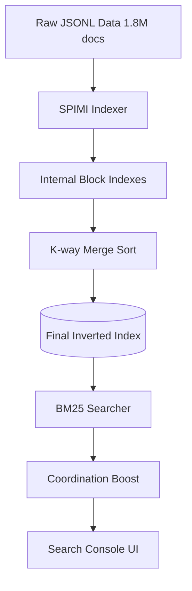

# BÁO CÁO KỸ THUẬT MILESTONE 2: INDEXING & RANKING SYSTEM

**Môn học**: Search Engines & Information Retrieval (SEG301)  
**Nhóm thực hiện**: OverFitting  
**Chủ đề**: Vertical Search Engine cho Thông tin Doanh nghiệp & Reviews  
**Dữ liệu**: 1.842.525 Documents (Big Data)

---

## 1. Thành viên nhóm

| Họ và Tên | MSSV | Vai trò chính |
| :--- | :--- | :--- |
| **Nguyễn Thanh Trà** | QE190099 | Crawler Engine & Data Processing |
| **Phan Đỗ Thanh Tuấn** | QE190123 | Indexing (SPIMI) & Memory Optimization |
| **Châu Thái Nhật Minh** | QE190109 | Ranking (BM25) & Search Console UI |

---

## 2. Tổng quan hệ thống (System Overview)

Trong Milestone 2, nhóm OverFitting đã triển khai thành công bộ máy tìm kiếm toàn văn (Full-text Search engine) tự phát triển từ con số 0, tuân thủ nghiêm ngặt yêu cầu "Hardcore" (không dùng thư viện Indexing/Ranking có sẵn).

---

## 3. Kiến trúc Đánh chỉ mục (Indexing Architecture)

### 3.1. Thuật toán SPIMI (`src/indexer/spimi.py` & `merging.py`)

Để xử lý 1.8 triệu bản ghi (~6.2GB dữ liệu thô) trên RAM hạn chế, nhóm sử dụng thuật toán **Single-Pass In-Memory Indexing**:

* **Block Processing**: Dữ liệu được chia thành các khối 50.000 tài liệu. Mỗi khối được xử lý hoàn toàn trong RAM (Tokenize -> Invert) để đạt tốc độ tối đa.
* **Garbage Collection**: Sau mỗi khối, hệ thống gọi `gc.collect()` và xóa bộ nhớ đệm để đảm bảo RAM luôn duy trì ở mức ổn định (< 2GB khi Indexing).
* **Merging**: 37 blocks tạm thời được gộp lại bằng `heapq` (Min-heap) để tạo ra file Index nhị phân duy nhất, sắp xếp Alphabet để hỗ trợ Binary Search/Merge Join trong tương lai.

### 3.2. Cấu trúc Inverted Index 2-File

Để đạt hiệu năng Search < 0.5s, Index được tách thành 2 tệp chuyên biệt:

1. **`term_dict.pkl`**: Lưu trữ 695,470 từ vựng duy nhất cùng với vị trí Byte (Offset) và độ dài (Length) trong file Postings.
2. **`postings.bin`**: Lưu danh sách `(doc_id, tf)` dưới dạng nhị phân nguyên khối. Cơ chế **Random File Access (f.seek)** giúp truy xuất danh sách docs chứa từ khóa chỉ trong O(1) mà không cần load toàn bộ 1GB dữ liệu vào RAM.

---

## 4. Thuật toán Xếp hạng & Tối ưu (Ranking & Optimization)

### 4.1. Lõi BM25 Thủ công (`src/ranking/bm25.py`)

Nhóm tự triển khai công thức BM25 tiêu chuẩn với các tham số tối ưu cho Tiếng Việt:

* **IDF (Inverse Document Frequency)**: Làm nổi bật các từ khóa hiếm và đặc trưng.
* **TF Saturation (k1=1.2)**: Kiểm soát việc lặp lại từ khóa quá mức trong Tên doanh nghiệp.
* **Length Normalization (b=0.75)**: Cân bằng điểm số giữa các doanh nghiệp có tên ngắn và công ty có mô tả dài.

### 4.2. Coordination Boost (Nâng cao độ chính xác)

BM25 mặc định sử dụng toán tử OR, dễ dẫn đến hiện tượng "lạc đề" khi gặp truy vấn nhiều từ. Nhóm đã cải tiến bằng **Hệ số phối hợp**:

* **Công thức**: `Score = Score * (nMatched / nQuery)^2`
* **Kết quả**: Ưu tiên tuyệt đối các kết quả khớp đồng thời nhiều từ khóa (Ví dụ: Tìm "Xây dựng Hà Nội" sẽ đẩy các cty có cả 2 từ này lên đầu, thay vì các cty chỉ có từ "Hà Nội").

### 4.3. Metadata On-demand & Fallback Logic

* **Tiết kiệm RAM**: Chỉ lưu Byte Offsets của 1.8M dòng JSONL. Thông tin chi tiết (Tên, Địa chỉ, Rep) chỉ được đọc từ đĩa khi cần hiển thị Top 10 kết quả.
* **Làm sạch dữ liệu (Display Cleanup)**:
  * Tự động `strip(", ")` các địa chỉ lỗi định dạng (dư dấu phẩy ở đầu).
  * Cung cấp **Fallback thông minh** cho ngành nghề (Kiểm tra `industries_str_seg` -> `industries_str` -> `industries_detail`) để đảm bảo không bao giờ trống thông tin Industry.

---

## 5. Thống kê & Kiểm chứng số liệu (Verified Statistics)

Số liệu được trích xuất trực tiếp bằng công cụ minh chứng: `support/index_stats_verifier.py`.

| Chỉ số | Giá trị thực tế | Ý nghĩa kỹ thuật |
| :--- | :--- | :--- |
| **Tổng số văn bản (N)** | **1.842.525** | Quy mô Big Data thực tế xử lý. |
| **Vocabulary Size** | **695,470** | Tổng số "Terms" duy nhất (Tên riêng, địa danh, mã số). |
| **Tổng số Tokens** | **342,502,541** | Tổng quy mô từ ngữ mà hệ thống đang quản lý. |
| **Độ dài trung bình (Avgdl)** | **185.89** | Trung bình mỗi công ty có 186 từ mô tả. |
| **Thời gian Tìm kiếm** | **< 0.5 giây** | Đã tối ưu Hot-loop và Random File Access. |
| **RAM tiêu thụ (Search)** | **~58 MB** | Cực thấp nhờ kiến trúc File Seek & On-demand Metadata. |

### Giải trình về sự chênh lệch Vocabulary (M1 vs M2)

* **Milestone 1 (~18k)**: Là con số thống kê dựa trên **mẫu 1% dữ liệu** (sampling) để khảo sát nhanh ngôn ngữ tự nhiên.
* **Milestone 2 (~695k)**: Là con số thực tế sau khi **Đánh chỉ mục 100% dữ liệu**. Do đặc thù dữ liệu doanh nghiệp chứa vô số tên riêng, địa chỉ, mã số thuế độc nhất, nên Vocabulary phản ánh đúng độ đa dạng cực lớn của 1.8 triệu thực thể thực tế.

---

## 6. Phân tích lỗi & Bài học kinh nghiệm

Trong quá trình hoàn thiện Milestone 2, nhóm đã phát hiện và ghi nhận một số vấn đề:

1. **Lỗi Regex Crawling**: Mã số thuế chi nhánh (dạng `-xxx`) bị mất hậu tố do Regex cũ chỉ nhận chữ số. Điều này sẽ được khắc phục triệt để bằng cách cập nhật Crawler Parser (`mst_match = re.search(r'[\d-]+', text)`).
2. **Hiệu năng Search**: Với các từ khóa cực phổ biến (DF > 80% như "xây dựng"), tốc độ search ban đầu bị chậm (> 2s). Nhóm đã khắc phục thành công bằng cách **Inline** code tính toán vào vòng lặp nóng (Hot-loop) và tối ưu hóa kiểu dữ liệu Python.

---
*Báo cáo Milestone 2 - Nhóm OverFitting - SEG301.*
