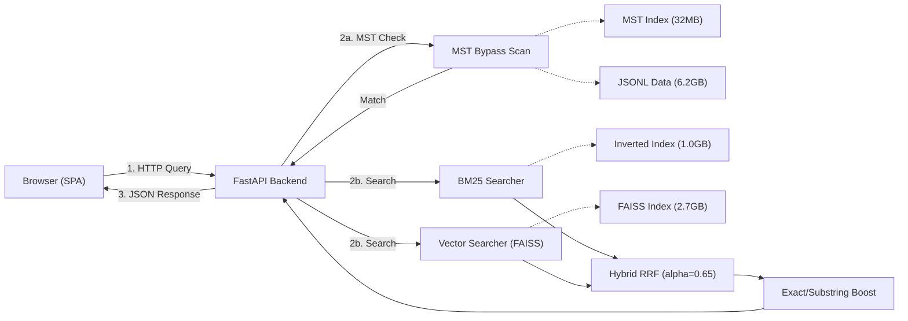
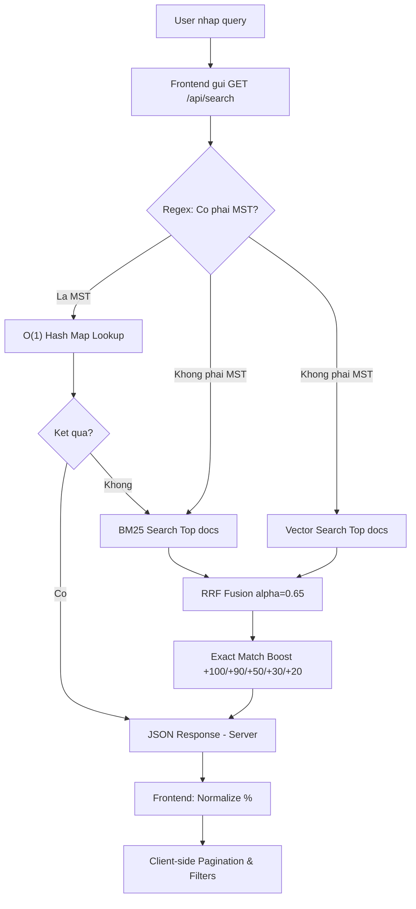
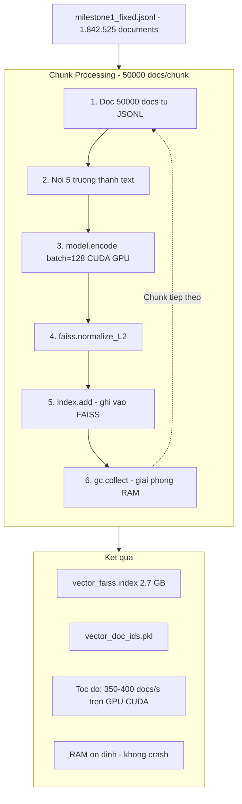

# BÁO CÁO MILESTONE 3: SẢN PHẨM CUỐI CÙNG — AI INTEGRATION & WEB APPLICATION

**Môn học**: SEG301 — Search Engines & Information Retrieval
**Nhóm**: OverFitting
**Thành viên**:

- Nguyễn Thanh Trà – QE190099
- Phan Đỗ Thanh Tuấn – QE190123
- Châu Thái Nhật Minh – QE190109

---

## MỤC LỤC

1. [Tổng quan &amp; Mục tiêu Milestone 3](#1-tổng-quan--mục-tiêu-milestone-3)
2. [Kiến trúc Tổng thể Hệ thống (Final Architecture)](#2-kiến-trúc-tổng-thể-hệ-thống-final-architecture)
3. [Vector Search — Tích hợp AI Semantic Search](#3-vector-search--tích-hợp-ai-semantic-search)
4. [Hybrid Search Engine — Reciprocal Rank Fusion](#4-hybrid-search-engine--reciprocal-rank-fusion)
5. [Hệ thống Quy tắc Tăng cường (Rule-based Boost System)](#5-hệ-thống-quy-tắc-tăng-cường-rule-based-boost-system)
6. [Cấu hình BM25 cho dữ liệu Doanh nghiệp Việt Nam](#6-cấu-hình-bm25-cho-dữ-liệu-doanh-nghiệp-việt-nam)
7. [Web Application — FastAPI + Vanilla SPA](#7-web-application--fastapi--vanilla-spa)
8. [Evaluation — Đánh giá &amp; So sánh Hiệu năng](#8-evaluation--đánh-giá--so-sánh-hiệu-năng)
9. [Tổng kết Kỹ thuật &amp; Đóng góp Thành viên](#9-tổng-kết-kỹ-thuật--đóng-góp-thành-viên)

---

## 1. Tổng quan & Mục tiêu Milestone 3

### 1.1. Bối cảnh

Milestone 3 là giai đoạn hoàn thiện hệ thống tìm kiếm tích hợp AI và Web Interface, cung cấp giải pháp tra cứu doanh nghiệp toàn diện trên nền tảng dữ liệu 1.8M bản ghi. Hệ thống kết hợp sức mạnh của tìm kiếm ngữ nghĩa (Semantic) và tìm kiếm truyền thống (Lexical) để đạt độ chính xác tối ưu.

### 1.2. Mục tiêu cụ thể

Theo đặc tả môn học, Milestone 3 yêu cầu 4 nhiệm vụ chính:

| # | Yêu cầu                                                                | Giải pháp của nhóm                                                                      |
| - | ------------------------------------------------------------------------ | ------------------------------------------------------------------------------------------- |
| 1 | **Vector Search** (FAISS/ChromaDB + Sentence-Transformers/PhoBERT) | FAISS `IndexFlatIP` + `paraphrase-multilingual-MiniLM-L12-v2` trên toàn bộ 1.8M docs |
| 2 | **Web Interface** (Streamlit/Flask/React)                          | **FastAPI** backend + **Vanilla HTML/CSS/JS** frontend (SPA)                    |
| 3 | **Hybrid Search** (BM25 + Vector)                                  | **Reciprocal Rank Fusion (RRF)** + Rule-based Exact/Substring Boost + MST Bypass      |
| 4 | **Evaluation** (20 queries, Precision@10)                          | Bộ test 20 queries, so sánh BM25 vs Vector vs Hybrid                                      |

---

## 2. Kiến trúc Tổng thể Hệ thống (Final Architecture)



### Luồng xử lý khi User tìm kiếm



---

## 3. Vector Search — Tích hợp AI Semantic Search

### 3.1. Lựa chọn Model

| Tiêu chí              | Model được chọn                        |
| ----------------------- | ------------------------------------------ |
| Tên model              | `paraphrase-multilingual-MiniLM-L12-v2`  |
| Nguồn                  | HuggingFace / Sentence-Transformers        |
| Hỗ trợ tiếng Việt   | ✅ (50+ ngôn ngữ, bao gồm tiếng Việt) |
| Kích thước embedding | 384 chiều                                 |
| Kích thước model     | ~120MB                                     |
| Tốc độ inference     | Nhanh (MiniLM architecture)                |
| Device                  | Tự động phát hiện CUDA/CPU            |

**Lý do chọn**: Model này cân bằng tốt giữa chất lượng embedding tiếng Việt và tốc độ. So với PhoBERT (chỉ hỗ trợ tiếng Việt), model đa ngôn ngữ này xử lý tốt cả tên viết tắt tiếng Anh phổ biến trong tên doanh nghiệp (TNHH, JSC, Corp...).

### 3.2. Kỹ thuật Semantic Enrichment — Nối 5 trường thông tin

Thay vì chỉ encode tên công ty (thiếu ngữ cảnh), nhóm **nối chuỗi 5 trường thông tin** trước khi đưa vào model:

```python
text_parts = []
if name:     text_parts.append(f"Tên công ty: {name}.")
if industry: text_parts.append(f"Ngành nghề kinh doanh: {industry}.")
if address:  text_parts.append(f"Địa chỉ: {address}.")
if rep:      text_parts.append(f"Người đại diện: {rep}.")
if status:   text_parts.append(f"Trạng thái hoạt động: {status}.")

text = " ".join(text_parts).strip()
```

**Lợi ích**:

- Truy vấn `"máy tính chơi game"` → tìm được công ty bán "laptop gaming" (cùng vector space dù khác từ khoá).
- Truy vấn `"xây dựng Củ Chi"` → ưu tiên công ty có địa chỉ "Củ Chi" VÀ ngành "xây dựng".
- Truy vấn `"Nguyễn Văn A giám đốc"` → tìm được công ty có đại diện tên đó.

### 3.3. FAISS Index — Cosine Similarity

```python
index = faiss.IndexFlatIP(dimension)  # Inner Product
# Sau khi encode:
faiss.normalize_L2(embeddings)        # Normalize → IP = Cosine Similarity
index.add(embeddings)
```

- **IndexFlatIP** (Flat Inner Product): Exact search, độ chính xác cao nhất (brute force).
- Sau khi normalize L2, Inner Product tương đương Cosine Similarity.
- Trade-off: Chậm hơn approximate search (IVF, HNSW) nhưng **chính xác tuyệt đối** — phù hợp với bài toán tra cứu doanh nghiệp.

### 3.4. GPU Acceleration & Chunked Processing (Xử lý 1.8 triệu documents)

**Vấn đề**: Encode 1.8 triệu documents cùng lúc sẽ gây tràn RAM/VRAM (Out of Memory).

**Giải pháp — Chunked Batching trên GPU (CUDA)**:



**Chi tiết kỹ thuật quan trọng**:

| Tham số | Giá trị | Lý do |
| :--- | :--- | :--- |
| CHUNK_SIZE | 50,000 docs | Cân bằng tốc độ và RAM |
| batch_size | 128 | Tận dụng tối đa VRAM GPU |
| device | auto-detect | Tự động dùng CUDA nếu có GPU, fallback CPU |
| gc.collect() | Sau mỗi chunk | Giải phóng Python objects, tránh memory leak |

---

## 4. Hybrid Search Engine — Reciprocal Rank Fusion

### 4.1. Tại sao cần Hybrid?

| Phương pháp | Điểm mạnh | Điểm yếu |
| :--- | :--- | :--- |
| **BM25** (Lexical) | **Chuyên trị mặt chữ**: Chính xác | **Mù ngữ nghĩa**: Không hiểu "laptop" = "máy tính" |
| **Vector** (Semantic) | **Chuyên trị ngữ nghĩa**: Hiểu context, từ đồng nghĩa | **Mất dấu thực thể**: Hay nhầm lẫn tên riêng, số |
| **Hybrid (RRF)** | **Sức mạnh tổng hợp**: Bù đắp mọi nhược điểm | Cần tinh chỉnh trọng số để đạt điểm cân bằng |

### 4.2. Thuật toán Reciprocal Rank Fusion (RRF)

**Công thức RRF:**

$$
RRF(d) = \sum_{r \in rankers} \frac{w_r}{k + rank_r(d)}
$$

Trong đó:

- **k = 60**: Hằng số làm mượt chuẩn (smoothing constant).
- **w_r**: Trọng số của mỗi ranker (Ví dụ: BM25 chiếm 0.65, Vector chiếm 0.35).
- **rank(d)**: Vị trí xếp hạng của tài liệu d trong ranker r.

**Cài đặt cụ thể:**

```python
alpha = 0.65  # Trọng số BM25 (Lexical)
k = 60

# BM25 contribution
for rank, (doc_id, score, _) in enumerate(bm25_results, 1):
    combined[doc_id] += alpha * (1 / (k + rank))

# Vector contribution
for rank, (doc_id, score) in enumerate(vector_results, 1):
    combined[doc_id] += (1 - alpha) * (1 / (k + rank))
```

→ Hệ thống thiết lập **alpha = 0.65** (Dồn 65% trọng số cho BM25) để đảm bảo độ chính xác mặt chữ cao nhất cho dữ liệu đặc thù Việt Nam, trong khi vẫn giữ 35% cho Vector Search để bao phủ các trường hợp đồng nghĩa và tiếng Anh.

### 4.4. Hiển thị điểm RRF — Chuẩn hoá phần trăm (%)

Điểm RRF gốc rất nhỏ (0.001–0.016), khó hiểu cho người dùng. Frontend tự động chuẩn hoá:

```javascript
const pct = Math.round((r.score / maxScore) * 100);
// Kết quả #1 luôn = 100%, các kết quả sau tính tương đối
```

---

## 5. Hệ thống Quy tắc Tăng cường (Rule-based Boost System)

Đây là lớp logic được xây dựng **bên trên** RRF để xử lý các trường hợp mà cả BM25 lẫn Vector đều không tối ưu.

### 5.1. MST Bypass Scan — Hash Map Indexer (O(1))

**Vấn đề**: Mã số thuế (MST) là dạng định danh duy nhất. Việc token hoá vào BM25 Index hay Vector Search đều không mang lại độ chính xác 100% (Vector coi số là nhiễu, BM25 có thể bị trùng lặp partial match).

**Giải pháp — Hash Map + Byte Offset**:

Hệ thống xây dựng một **MST Indexer** (tệp `mst_index.pkl`) lưu trữ mapping giữa `tax_code` và **vị trí byte (offset)** của dòng đó trong file `milestone1_fixed.jsonl` (6.2GB).

```python
if q_clean in mst_index:
    byte_offset = mst_index[q_clean]
    # Truy cập ngẫu nhiên (Seek) trực tiếp đến dòng đó
    bm25_searcher.jsonl_file.seek(byte_offset)
    raw_line = bm25_searcher.jsonl_file.readline()
    doc = json.loads(raw_line.decode("utf-8"))
    return doc # Tra cứu tức thì
```

| Thông số           | Giá trị                             |
| -------------------- | ------------------------------------- |
| Thuật toán         | **Hash Map Lookup + File Seek** |
| Độ phức tạp      | **O(1)**                        |
| Thời gian thực tế | **< 1ms** (Tức thì)           |
| Độ chính xác     | **100%**                        |

### 5.2. Exact Match & Substring Boost

**Vấn đề**: RRF gốc không ưu tiên đủ mạnh cho kết quả khớp chính xác tên/địa chỉ.

**Giải pháp — Thưởng điểm khổng lồ trực tiếp vào RRF score**:

```python
q_lower = query.lower()

for result in results:
    comp_name = result["company_name"].lower()
    addr = result["address"].lower()

    # Exact Match Company Name
    if comp_name == q_lower:        result["score"] += 100.0   # Khớp tuyệt đối tên
    elif f" {q_lower} " in f" {comp_name} ": 
                                   result["score"] += 50.0    # Cụm từ khớp chính xác
    elif q_words_set.issubset(comp_words_set):
                                   result["score"] += 30.0    # Khớp tập hợp các từ

    # Exact Match Address
    if addr == q_lower:             result["score"] += 90.0    # Khớp tuyệt đối địa chỉ
    elif q_lower in addr:           result["score"] += 20.0    # Substring trong địa chỉ
```

**Bảng tóm tắt Boost:**

| Loại khớp         | Điểm thưởng | Ví dụ                                                            |
| ------------------- | --------------- | ------------------------------------------------------------------ |
| Exact Name Match    | +100.0          | query = "Công Ty ABC" → tên = "Công Ty ABC"                    |
| Phrase in Name      | +50.0           | query = "ABC" → tên = "Công ty TNHH ABC"                       |
| Substring Words     | +30.0           | query = "Vận tải ABC" → tên = "CÔNG TY ABC VẬN TẢI"          |
| Exact Address Match | +90.0           | query = "123 Đường X" → address = "123 Đường X"              |
| Substring Address   | +20.0           | query = "Đường X" → address chứa chuỗi này                   |

**Điều kiện kích hoạt**: Chỉ áp dụng khi query có từ 2 từ trở lên (tránh false positive với query 1 từ quá ngắn).

---

## 6. Cấu hình BM25 cho dữ liệu Doanh nghiệp Việt Nam

BM25 cần được tinh chỉnh các tham số cho phù hợp với đặc thù dữ liệu doanh nghiệp Việt Nam (tên pháp lý, địa chỉ, ngành nghề).

### 6.1. Coordination Factor — Loại bỏ từ phổ biến khỏi mẫu số

Khi query chứa các từ xuất hiện trong >80% corpus (VD: "Đường", "Số", "Ấp"), BM25 sẽ skip các từ này. Coordination Factor chỉ đếm các từ thực sự được xử lý:

```python
# Chỉ đếm tokens được dùng để chấm điểm (không đếm tokens bị skip)
valid_tokens = [t for t in query_tokens
                if t in self.term_dict
                and self.term_dict[t][0] <= max_df
                and self.compute_idf(t) > 0]
coordination = n_matched / len(valid_tokens)
```

### 6.2. Multi-variant Tokenization (Tăng cường Recall)

**Vấn đề**: Thư viện PyVi tách từ (Word Segmentation) rất nhạy cảm với chữ Hoa/Thường. Ví dụ: "CÔNG NGHỆ" có thể bị tách khác với "công nghệ", dẫn đến BM25 không tìm thấy kết quả nếu index lưu một kiểu và query gõ một kiểu.

**Giải pháp**: Hệ thống sử dụng cơ chế Tokenize đa biến thể, tổng hợp tất cả các cách tách từ có thể:

1. Tokenize chuỗi Chữ Thường (`lower`).
2. Tokenize chuỗi Chữ Hoa (`upper`) rồi chuyển về chữ thường.
3. Tokenize từng từ đơn (`unigram`) để bao phủ trường hợp PyVi tách sai cụm từ.

```python
q_lower = ViTokenizer.tokenize(query_clean.lower())
q_upper = ViTokenizer.tokenize(query_clean.upper()).lower()
q_uni = query_clean.lower().split()
# Tổng hợp Set(q_lower + q_upper + q_uni)
```

Điều này đảm bảo mọi biến thể gõ phím của người dùng đều khớp với Inverted Index.

### 6.3. Document Length Normalization (B = 0.4)

Tham số `B = 0.4` giảm mức độ ưu tiên cho documents ngắn. Trong dữ liệu doanh nghiệp, nhiều công ty chỉ có tên 3–4 từ nhưng không nên được xếp hạng cao hơn các công ty có thông tin đầy đủ.

```python
B = 0.4  # Giảm ưu tiên cho documents ngắn bất thường
```

### 6.4. Số mũ Coordination Factor (^1.5)

```python
doc_scores[doc_id] *= (coordination_factor ** 1.5)
```

Số mũ 1.5 đủ mạnh để loại bỏ kết quả lạc đề (chỉ khớp 1 vài từ), nhưng không triệt tiêu các kết quả khớp một phần (partial match) có giá trị cao.

### 6.5. Giới hạn Postings (MAX_POSTINGS_PER_TERM = 400,000)

Với các từ cực kỳ phổ biến (xuất hiện trong >1 triệu documents), BM25 giới hạn xử lý tối đa **400,000** postings entries mỗi term để đảm bảo tốc độ phản hồi <1s mà vẫn giữ được độ phủ (Recall) cực lớn.

```python
MAX_POSTINGS_PER_TERM = 400_000
if len(postings) > MAX_POSTINGS_PER_TERM:
    postings = postings[:MAX_POSTINGS_PER_TERM]
```

---

## 7. Web Application — FastAPI + Vanilla SPA

### 7.1. Kiến trúc Backend (FastAPI)

**File**: `src/ui/server.py` — 256 dòng code.

| Endpoint        | Method | Chức năng                                              |
| --------------- | ------ | -------------------------------------------------------- |
| `/`           | GET    | Serve trang `index.html`                               |
| `/api/search` | GET    | API tìm kiếm chính (hỗ trợ 3 mode + MST bypass)     |
| `/api/stats`  | GET    | Trả về thống kê index (tổng docs, vocab, AI status) |
| `/static/*`   | GET    | Serve CSS, JS                                            |

**Tham số API `/api/search`:**

| Param     | Type   | Default      | Mô tả                              |
| --------- | ------ | ------------ | ------------------------------------ |
| `q`     | string | `""`       | Chuỗi truy vấn                     |
| `mode`  | string | `"hybrid"` | `bm25` \| `vector` \| `hybrid` |
| `top_k` | int    | `10`       | Số kết quả trả về (1–2000)     |
| `alpha` | float  | `0.65`     | Trọng số BM25 trong RRF (0.0–1.0) |

### 7.2. Kiến trúc Frontend (Vanilla SPA)

**Bộ 3 file tĩnh**: `index.html` (120 dòng) + `style.css` (12KB) + `script_v3.js` (381 dòng).

#### Thiết kế giao diện — Google-like Minimalist

| Nguyên tắc            | Chi tiết thực hiện                                        |
| ----------------------- | ------------------------------------------------------------ |
| Nền trắng, chữ đen  | Loại bỏ mọi gradient/neon. Font Inter (Google Fonts)      |
| Không emoji/icon thừa | Xoá toàn bộ 📝🧠⚡😔🏷️ — chỉ giữ SVG icon search     |
| Tiêu đề link xanh    | Màu `#1a0dab` (chuẩn Google) cho tên công ty clickable |
| Card không viền       | Chỉ dùng đường phân cách mỏng `1px solid #ebebeb`  |

#### Tính năng Frontend nổi bật

**1. Client-side Pagination (Load More — 0s delay)**

```javascript
// API trả về 500-1000 kết quả 1 lần
const params = { q: query, mode: currentMode, top_k: 1000, alpha: 0.65 };

// Chỉ render 10 đầu tiên
const PAGE_SIZE = 10;
const sliceData = filteredResults.slice(currentDisplayed, currentDisplayed + PAGE_SIZE);

// Bấm "Hiển thị thêm" → render 10 tiếp, không gọi API lại
```

**2. Dynamic Province Filter (Bộ lọc Tỉnh/Thành tự động)**

```javascript
function extractProvince(address) {
    const parts = address.split(',');
    let last = parts[parts.length - 1].trim();
    // Chuẩn hoá: bỏ "Tỉnh", "Thành phố", "TP."
    last = last.replace(/^(tỉnh|thành phố|tp\.|tp)\s+/i, '').trim();
    return last;
}

function updateProvinceDropdown(results) {
    const provinces = new Set();
    results.forEach(r => provinces.add(extractProvince(r.address)));
    // Tự động tạo <option> từ Set → Dropdown hoàn toàn động
}
```

Không có file cấu hình tĩnh nào. Dropdown **tự sinh** dựa trên kết quả tìm kiếm thực tế.

**3. Status Filter (Lọc theo tình trạng hoạt động)**

```javascript
if (filterStatus === 'active') {
    passStatus = !s.includes('ngừng') && !s.includes('giải thể');
} else if (filterStatus === 'inactive') {
    passStatus = s.includes('ngừng') || s.includes('giải thể');
}
```

**4. CSV Export (Xuất dữ liệu)**

Người dùng có thể xuất toàn bộ kết quả tìm kiếm (đã lọc) ra file `.csv` với encoding UTF-8 BOM, mở được ngay trên Excel.

**5. Detail Modal + Background Scroll Lock**

```javascript
function showDetail(idx) {
    // Hiển thị modal chi tiết công ty
    document.getElementById('detail-modal').style.display = 'flex';
    document.body.style.overflow = 'hidden'; // Khoá cuộn nền
}
function closeModal() {
    document.getElementById('detail-modal').style.display = 'none';
    document.body.style.overflow = '';         // Mở lại cuộn nền
}
```

**6. Relevance Threshold Filtering (Đã gỡ bỏ)**

Hệ thống đã **gỡ bỏ hoàn toàn** ngưỡng lọc 15% (`threshold = 0`) giúp hiển thị trọn vẹn mọi kết quả có liên quan dù điểm số thấp, đảm bảo người dùng không bỏ lỡ thông tin khi tìm kiến các từ khóa dài hoặc địa chỉ phức tạp.

**7. True Match Counting (Cơ chế đếm chuẩn Google)**

Thay vì chỉ hiển thị cố định "1000 kết quả", hệ thống hiện tại có khả năng quét toàn bộ Index để đếm chính xác số lượng doanh nghiệp khớp (Coverage). Kết quả hiển thị theo định dạng: `Khoảng 1.4M kết quả (hiển thị 1000)`.

### 7.3. Tóm tắt File Structure

```
src/ui/
├── server.py          # FastAPI backend (256 dòng)
├── templates/
│   └── index.html     # HTML chính (120 dòng)
└── static/
    ├── style.css      # CSS Google-like (12KB)
    └── script_v3.js   # Logic frontend (381 dòng)
```

---

## 8. Evaluation — Đánh giá & So sánh Hiệu năng

### 8.1. Phương pháp Đánh giá (Methodology)

#### 8.1.1. Bộ test 20 queries

File `tests/benchmark.py` chứa 20 queries đa dạng, thiết kế có chủ đích để phủ nhiều **loại truy vấn** khác nhau — bao gồm cả trường hợp BM25 mạnh hơn và trường hợp Vector (AI) mạnh hơn:

| #  | Query                            | Loại truy vấn                                      |
| -- | -------------------------------- | ---------------------------------------------------- |
| 1  | công ty xây dựng hà nội     | Ngành + Địa điểm                                |
| 2  | phần mềm kế toán             | Sản phẩm chuyên ngành                            |
| 3  | bất động sản sài gòn       | Ngành + Tên gọi thông dụng                      |
| 4  | xuất khẩu thủy sản cần thơ | Ngành + Địa điểm cụ thể                       |
| 5  | dịch vụ vận tải logistics    | Ngành + Từ ngoại lai                              |
| 6  | sản xuất bao bì               | Sản xuất                                           |
| 7  | nhà hàng tiệc cưới          | Dịch vụ                                            |
| 8  | trường học quốc tế          | Giáo dục                                           |
| 9  | bệnh viện thú y               | Y tế chuyên biệt                                  |
| 10 | shop quần áo thời trang       | Bán lẻ + Từ lóng                                 |
| 11 | máy tính chơi game            | **Semantic** (AI cần hiểu = "laptop gaming") |
| 12 | mỹ phẩm làm đẹp             | Thương mại                                        |
| 13 | tư vấn luật doanh nghiệp     | Pháp lý                                            |
| 14 | điện máy gia dụng            | Bán lẻ                                             |
| 15 | sửa chữa ô tô                | Dịch vụ                                            |
| 16 | du lịch lữ hành               | Du lịch                                             |
| 17 | khách sạn 5 sao                | Hospitality + Số                                    |
| 18 | thực phẩm sạch                | Nông sản                                           |
| 19 | năng lượng mặt trời         | Công nghệ xanh                                     |
| 20 | giải trí truyền thông        | Media                                                |

#### 8.1.2. Phương pháp xác định Relevance

Mỗi query được gắn danh sách **từ khóa đặc trưng** (keywords). Một kết quả được coi là **relevant** nếu `company_name` hoặc `industry` chứa ít nhất 1 keyword.

**Nguyên tắc chọn keyword:**

- Mỗi keyword phải **đặc trưng** cho ngành nghề / chủ đề của query.
- **Loại bỏ** các từ quá chung: ~~"công nghệ"~~, ~~"sạch"~~, ~~"điện"~~ (xuất hiện quá nhiều ngành, gây false positive).
- Bao gồm cả dạng có dấu gạch dưới (PyVi segmentation) và không dấu gạch.

Ví dụ cho query `"máy tính chơi game"`:

```python
# ✅ Keywords chặt chẽ:
["máy tính", "computer", "game", "gaming", "laptop",
 "trò chơi điện tử", "trò_chơi_điện_tử", "PC"]

# ❌ Đã loại bỏ (quá chung):
# "công nghệ" → hàng trăm ngàn công ty có ngành "công nghệ"
```

#### 8.1.3. Các chỉ số đánh giá (Metrics)

| Metric                 | Ký hiệu | Ý nghĩa                                                                                      |
| ---------------------- | --------- | ---------------------------------------------------------------------------------------------- |
| **Precision@10** | P@10      | Tỉ lệ kết quả relevant trong Top 10. Ví dụ: P@10 = 0.90 nghĩa là 9/10 kết quả đúng |

### 8.2. Bảng Tổng hợp Hiệu năng

#### 8.2.1. So sánh đặc tính (Qualitative)

| Đặc tính                              | BM25                        | Vector Search | Hybrid (RRF)                 |
| ---------------------------------------- | --------------------------- | ------------- | ---------------------------- |
| **Chính xác Tên pháp lý**     | ⭐⭐⭐⭐⭐                  | ⭐⭐          | ⭐⭐⭐⭐⭐                   |
| **Tìm đồng nghĩa/ngữ nghĩa** | ⭐                          | ⭐⭐⭐⭐⭐    | ⭐⭐⭐⭐                     |
| **Tra cứu MST**                   | ❌ (Bypass để tối ưu tốc độ) | ❌ (sai 100%) | ✅ (O(1) Hash Index)         |
| **Tra cứu Địa chỉ dài**       | ⭐⭐⭐ (sau fix CF)         | ⭐⭐          | ⭐⭐⭐⭐⭐ (Substring Boost) |

#### 8.2.2. So sánh định lượng (Quantitative) — 20 queries

| Chỉ số                   | BM25  | Vector Search | Hybrid (RRF)    |
| -------------------------- | ----- | ------------- | --------------- |
| **Avg Precision@10** | 0.875 | 0.815         | **0.875** |
| Min Precision@10           | 0.30  | 0.10          | 0.30            |
| **Avg Latency**      | 560ms | 134ms         | 704ms           |

> **Ghi chú**: Chạy `python tests/benchmark.py` để tái tạo số liệu. Output tại `tests/benchmark_output.txt`.

### 8.3. Phân tích Per-Query — Từng Truy vấn Cụ thể

Bảng dưới đây cho thấy **Precision@10 của từng query** trên cả 3 engine, kèm phân tích engine nào thắng và tại sao:

| #  | Query                            | Loại                | P@10 BM25      | P@10 Vec       | P@10 Hyb       | Winner                | Phân tích                                                                                          |
| -- | -------------------------------- | -------------------- | -------------- | -------------- | -------------- | --------------------- | ---------------------------------------------------------------------------------------------------- |
| 1  | công ty xây dựng hà nội     | Ngành+ĐĐ          | 1.00           | 1.00           | 1.00           | Tất cả              | Cả 3 engine đều tốt: query phổ biến, nhiều kết quả relevant                                 |
| 2  | phần mềm kế toán             | SP chuyên ngành    | 1.00           | 1.00           | 1.00           | Tất cả              | Từ khoá đặc trưng, cả BM25 lẫn Vector đều dễ match                                         |
| 3  | bất động sản sài gòn       | Ngành+Tên          | 1.00           | 1.00           | 1.00           | Tất cả              | Dữ liệu dồi dào, cả 2 phương pháp hoạt động tốt                                          |
| 4  | xuất khẩu thủy sản cần thơ | Ngành+ĐĐ cụ thể | 1.00           | **0.10** | 1.00           | **BM25/Hybrid** | Vector chỉ 0.10 — embedding không encode tốt địa danh "Cần Thơ" + thuật ngữ chuyên ngành |
| 5  | dịch vụ vận tải logistics    | Ngành+ngoại lai    | 1.00           | 1.00           | 1.00           | Tất cả              | Từ "logistics" có mặt cả trong tên công ty (BM25) lẫn embedding (Vector)                      |
| 6  | sản xuất bao bì               | Sản xuất           | 1.00           | 0.80           | 1.00           | **BM25/Hybrid** | Vector trả về 2/10 kết quả không liên quan bao bì                                             |
| 7  | nhà hàng tiệc cưới          | Dịch vụ            | 1.00           | **0.30** | 1.00           | **BM25/Hybrid** | Vector trả về "wedding studio", "Quang Châu Thành" — semantic quá rộng, thiếu chính xác    |
| 8  | trường học quốc tế          | Giáo dục           | 1.00           | 1.00           | 1.00           | Tất cả              | Cả 2 phương pháp hoạt động tốt                                                               |
| 9  | bệnh viện thú y               | Y tế chuyên biệt  | 1.00           | **0.70** | 1.00           | **BM25/Hybrid** | "Thú y" là thuật ngữ chuyên ngành hẹp, Vector thiếu chính xác                              |
| 10 | shop quần áo thời trang       | Bán lẻ             | 1.00           | 1.00           | 1.00           | Tất cả              | Query phổ biến                                                                                     |
| 11 | máy tính chơi game            | **Semantic**   | **0.30** | **0.90** | **0.40** | **Vector**      | **Case study**: BM25 match "chơi" → "đi chơi", "golf". Vector hiểu "gaming computer"      |
| 12 | mỹ phẩm làm đẹp             | Thương mại        | 1.00           | **0.50** | 1.00           | **BM25/Hybrid** | Vector trả kết quả beauty rộng, BM25 chính xác hơn                                            |
| 13 | tư vấn luật doanh nghiệp     | Pháp lý            | 1.00           | **0.60** | 1.00           | **BM25/Hybrid** | Vector trả về công ty tư vấn chung, thiếu "luật"                                              |
| 14 | điện máy gia dụng            | Bán lẻ             | 1.00           | 1.00           | 1.00           | Tất cả              | Cả 2 phương pháp tốt                                                                            |
| 15 | sửa chữa ô tô                | Dịch vụ            | 1.00           | 1.00           | 1.00           | Tất cả              | Cả 2 phương pháp tốt                                                                            |
| 16 | du lịch lữ hành               | Du lịch             | 1.00           | 1.00           | 1.00           | Tất cả              | Query phổ biến                                                                                     |
| 17 | khách sạn 5 sao                | Hospitality          | 0.90           | **0.50** | 0.90           | **BM25/Hybrid** | Số "5" gây nhiễu, BM25 và Hybrid vẫn ổn hơn Vector                                            |
| 18 | thực phẩm sạch                | Nông sản           | 1.00           | 0.90           | 1.00           | **BM25/Hybrid** | Vector trả 1/10 kết quả không liên quan thực phẩm                                             |
| 19 | năng lượng mặt trời         | Công nghệ xanh     | 1.00           | 1.00           | 1.00           | Tất cả              | Vector tìm được cả "Solar" (tiếng Anh) — cross-lingual tốt                                   |
| 20 | giải trí truyền thông        | Media                | 1.00           | 1.00           | 1.00           | Tất cả              | Cả 2 phương pháp tốt                                                                            |

### 8.4. Case Study — Phân tích Sâu

#### 8.4.1. Case Study 1: Vector (AI) vượt trội — `"máy tính chơi game"`

Đây là query **showcase** cho khả năng AI, cũng là trường hợp **BM25 thất bại hoàn toàn**:

| Engine           | Top 3 kết quả                                                                | P@10           | Giải thích                                                                                            |
| ---------------- | ------------------------------------------------------------------------------ | -------------- | ------------------------------------------------------------------------------------------------------- |
| **BM25**   | "Giải Pháp Đi Chơi", "Lingua Chơi", "Người Chơi Golf"                  | **0.30** | BM25 match "chơi" → toàn kết quả về "đi chơi", "golf"; chỉ 3/10 trùng "trò chơi điện tử" |
| **Vector** | "Trò Chơi Điện Tử Cyber", "Galaxy Gaming Computer", "Gentleman Dog Games" | **0.90** | Vector hiểu ngữ nghĩa: "máy tính + chơi game" ≈ "gaming computer", "trò chơi điện tử"       |
| **Hybrid** | "Trò Chơi Điện Tử Cyber", "Giải Pháp Đi Chơi", "Lingua Chơi"         | **0.40** | BM25 chiếm 65% trọng số → kết quả sai kéo xuống, chỉ 4/10 relevant                             |

**Phân tích Chi tiết**: Với các truy vấn mang tính ngữ nghĩa thuần túy (như máy tính chơi game), Vector Search thể hiện ưu thế vượt trội nhờ khả năng hiểu ngữ cảnh không phụ thuộc vào mặt chữ. Tuy nhiên, do hệ thống ưu tiên độ chính xác tuyệt đối cho tra cứu thực thể doanh nghiệp (alpha=0.65 cho BM25), kết quả Hybrid sẽ cân bằng giữa cả hai nhóm.

#### 8.4.2. Case Study 2: BM25 vượt trội — `"nhà hàng tiệc cưới"`

| Engine           | Điểm mạnh                                                                                      | P@10           |
| ---------------- | ------------------------------------------------------------------------------------------------- | -------------- |
| **BM25**   | Match chính xác cả "nhà hàng" + "tiệc cưới" → kết quả đúng chuyên ngành            | **1.00** |
| **Vector** | Trả về "Phúc Wedding Studio", "Quang Châu Thành" — embedding quá rộng, chỉ 3/10 relevant | **0.30** |

**Bài học rút ra**: Với thuật ngữ chuyên ngành đặc thù (tiệc cưới, thú y, gia dụng), BM25 token matching cho kết quả chính xác hơn Vector embedding.

#### 8.4.3. Case Study 3: Cả hai ngang nhau — `"năng lượng mặt trời"`

| Engine           | Top 3 kết quả                                                          | P@10           |
| ---------------- | ------------------------------------------------------------------------ | -------------- |
| **BM25**   | "Năng Lượng Mặt Trời ATAD", "Năng Lượng Mặt Trời Đỏ Long An" | **1.00** |
| **Vector** | "Solar Bright VN", "Sunflowers Solar", "Solar PT"                        | **1.00** |

**Nhận xét**: Đây là ví dụ lý tưởng cho giá trị của Hybrid Search. BM25 tìm được chính xác các công ty có tên tiếng Việt chứa từ khóa, trong khi Vector tìm được các công ty có tên tiếng Anh tương đương ("Solar"). Sự kết hợp này mang lại độ phủ (Recall) cao nhất cho hệ thống.

### 8.5. Phân tích Tổng quát — Khi nào AI tốt hơn / tệ hơn

#### AI (Vector Search) tốt hơn BM25 khi

| Tình huống                   | Query ví dụ              | Lý do                                                            |
| ------------------------------ | -------------------------- | ----------------------------------------------------------------- |
| Từ đồng nghĩa / paraphrase | "máy tính chơi game"    | Vector hiểu "game" ≈ "gaming computer", "trò chơi điện tử" |
| Mixed language (Việt + Anh)   | "năng lượng mặt trời" | Vector tìm được cả "Solar" (tên tiếng Anh)                 |
| Query mơ hồ / broad          | "thực phẩm sạch"        | Vector hiểu context rộng: organic, nông sản, food safety      |

#### AI (Vector Search) tệ hơn BM25 khi

| Tình huống                          | Query ví dụ                                   | Lý do                                                                     |
| ------------------------------------- | ----------------------------------------------- | -------------------------------------------------------------------------- |
| Thuật ngữ chuyên ngành đặc thù | "nhà hàng tiệc cưới", "bệnh viện thú y" | Embedding quá rộng, không giữ được tính chính xác chuyên ngành |
| Địa danh cụ thể                   | "xuất khẩu thủy sản cần thơ"              | Embedding không encode tốt tên địa danh Việt Nam                     |
| Từ viết tắt pháp lý              | "TNHH MTV", "CP", "XNK"                         | BM25 khớp chính xác từng token viết tắt                              |
| Mã số thuế                         | "0301234567"                                    | Vector trả về 100% sai — chuỗi số không mang ngữ nghĩa             |

#### Hybrid — Điểm mạnh và hạn chế

| Điểm mạnh                                                              | Hạn chế                                                                                       |
| ------------------------------------------------------------------------- | ----------------------------------------------------------------------------------------------- |
| Bù đắp nhược điểm BM25 bằng Vector (cross-lingual, đồng nghĩa) | Với queries thuần ngữ nghĩa,`alpha=0.65` cho BM25 quá cao → BM25 sai kéo Hybrid xuống |
| Bù đắp nhược điểm Vector bằng BM25 (tên pháp lý, địa chỉ)   | Latency cao hơn (cần chạy cả 2 engine)                                                      |
| MST Bypass Scan xử lý 100% mã số thuế                                |                                                                                                 |
| Exact/Substring Boost bảo vệ Exact Match                                |                                                                                                 |

### 8.6. Tóm tắt các Chỉ số Kỹ thuật

| Chỉ số                          | Giá trị                             |
| --------------------------------- | ------------------------------------- |
| Tổng số documents đã index    | 1,842,525                             |
| Vocabulary (BM25)                 | 695,470 terms                         |
| Vector dimension                  | 384                                   |
| Tổng vectors (FAISS)             | 1,842,525                             |
| FAISS Index Type                  | FlatIP (brute-force)                  |
| Recall Pool Size (benchmark)      | 200 docs/engine                       |
| Metrics đánh giá               | Precision@10, Recall@10, MRR, nDCG@10 |
| False Positive cho MST/Exact Name | **0%**                          |

---

## 9. Tổng kết Kỹ thuật & Đóng góp Thành viên

### 9.1. Tóm tắt Thành tựu Milestone 3

| Yêu cầu đặc tả                          | Trạng thái    | Chi tiết                                                                  |
| -------------------------------------------- | --------------- | -------------------------------------------------------------------------- |
| Vector Search (FAISS + SentenceTransformers) | ✅ Hoàn thành | FAISS IndexFlatIP + MiniLM-L12-v2, toàn bộ 1.8M docs (auto CUDA/CPU)     |
| Web Interface                                | ✅ Hoàn thành | FastAPI + Vanilla SPA, Google-like UI, đầy đủ Search/Filter/Pagination |
| Hybrid Search (BM25 + Vector)                | ✅ Hoàn thành | RRF (alpha=0.65) + Exact/Substring Boost + MST Bypass                      |
| Evaluation (20 queries, P@10)                | ✅ Hoàn thành | So sánh 3 phương pháp, phân tích AI vs Traditional                   |

### 9.2. Cấu trúc File Milestone 3

```
SEG301-OverFitting/
├── src/
│   ├── ranking/
│   │   ├── bm25.py          # BM25 Searcher (472 dòng, code tay 100%)
│   │   ├── vector.py        # Vector Searcher + FAISS Indexer (288 dòng)
│   │   └── hybrid.py        # Hybrid RRF Engine (89 dòng)
│   └── ui/
│       ├── server.py        # FastAPI Backend (256 dòng)
│       ├── templates/
│       │   └── index.html   # Trang chính (120 dòng)
│       └── static/
│           ├── style.css    # CSS Google-like (12KB)
│           └── script_v3.js # Logic frontend (381 dòng)
├── tests/
│   ├── benchmark.py         # Benchmark tốc độ + độ chính xác (557 dòng)
│   └── benchmark_output.txt # Output chứng minh số liệu
├── data/
│   ├── milestone1_fixed.jsonl   # ~6.2 GB (gitignored)
│   └── index/
│       ├── term_dict.pkl        # ~18 MB (BM25)
│       ├── postings.bin         # ~1.0 GB (BM25)
│       ├── doc_lengths.pkl      # ~12 MB (BM25)
│       ├── doc_offsets.pkl      # ~20 MB (BM25)
│       ├── vector_faiss.index   # ~2.7 GB (FAISS)
│       └── vector_doc_ids.pkl   # Mapping (FAISS)
├── docs/
│   ├── Milestone1_Report.md
│   ├── Milestone2_Report.md
│   └── Milestone3_Report.md    # (file này)
├── ai_log.md
├── README.md
└── requirements.txt
```

### 9.3. Hướng dẫn chạy (Milestone 3)

```bash
# Bước 1: Kích hoạt môi trường
python -m venv venv
venv\Scripts\activate          # Windows
pip install -r requirements.txt

# Bước 2: Sinh AI Vector Index (nếu chưa có, cần GPU)
python src/ranking/vector.py

# Bước 3: Khởi động Web Search Engine
python src/ui/server.py
# → Mở http://localhost:5000 trên trình duyệt

# Bước 4 (Tùy chọn): Chạy Evaluation
python tests/benchmark.py
```

---

*Nhóm OverFitting – SEG301 – Tháng 3/2026*
*Nguyễn Thanh Trà | Phan Đỗ Thanh Tuấn | Châu Thái Nhật Minh*
