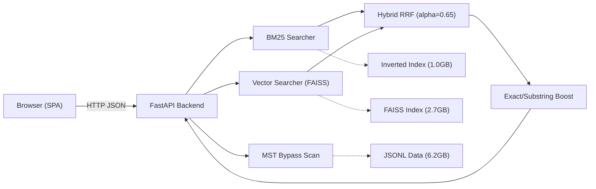
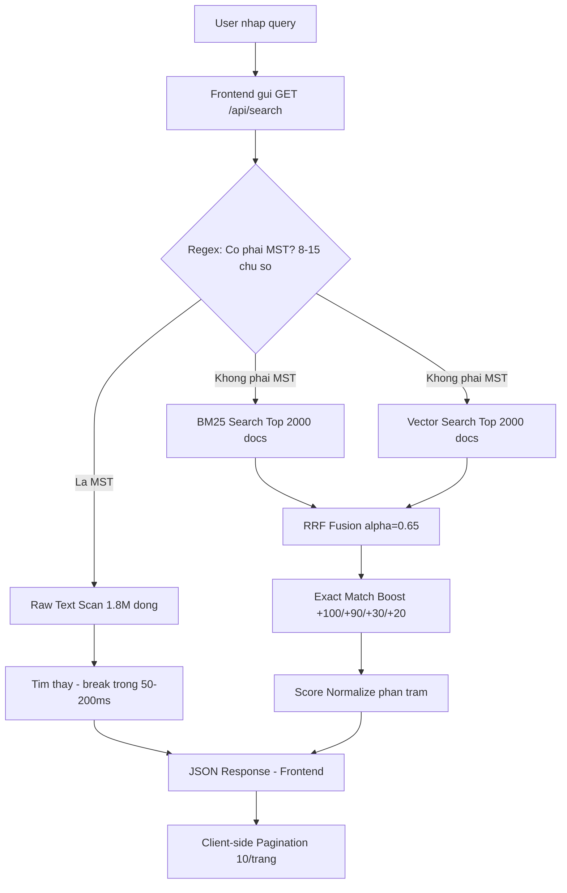
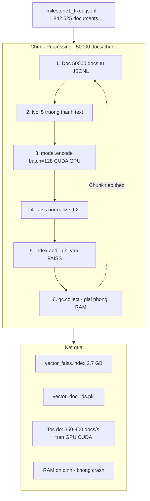

# BÁO CÁO MILESTONE 3: SẢN PHẨM CUỐI CÙNG — AI INTEGRATION & WEB APPLICATION

**Môn học**: SEG301 — Search Engines & Information Retrieval
**Nhóm**: OverFitting
**Thành viên**:

- Nguyễn Thanh Trà – QE190099
- Phan Đỗ Thanh Tuấn – QE190123
- Châu Thái Nhật Minh – QE190109

---

## MỤC LỤC

1. [Tổng quan &amp; Mục tiêu Milestone 3](#1-tổng-quan--mục-tiêu-milestone-3)
2. [Kiến trúc Tổng thể Hệ thống (Final Architecture)](#2-kiến-trúc-tổng-thể-hệ-thống-final-architecture)
3. [Vector Search — Tích hợp AI Semantic Search](#3-vector-search--tích-hợp-ai-semantic-search)
4. [Hybrid Search Engine — Reciprocal Rank Fusion](#4-hybrid-search-engine--reciprocal-rank-fusion)
5. [Hệ thống Quy tắc Tăng cường (Rule-based Boost System)](#5-hệ-thống-quy-tắc-tăng-cường-rule-based-boost-system)
6. [Cấu hình BM25 cho dữ liệu Doanh nghiệp Việt Nam](#6-cấu-hình-bm25-cho-dữ-liệu-doanh-nghiệp-việt-nam)
7. [Web Application — FastAPI + Vanilla SPA](#7-web-application--fastapi--vanilla-spa)
8. [Evaluation — Đánh giá &amp; So sánh Hiệu năng](#8-evaluation--đánh-giá--so-sánh-hiệu-năng)
9. [Tổng kết Kỹ thuật &amp; Đóng góp Thành viên](#9-tổng-kết-kỹ-thuật--đóng-góp-thành-viên)

---

## 1. Tổng quan & Mục tiêu Milestone 3

### 1.1. Bối cảnh

Milestone 3 là giai đoạn cuối cùng, kế thừa toàn bộ thành quả từ:

- **Milestone 1**: Bộ dữ liệu **1.842.525 doanh nghiệp** đã qua làm sạch, tách từ tiếng Việt (PyVi), loại trùng lặp.
- **Milestone 2**: Hệ thống **Inverted Index (SPIMI)** và **BM25 Ranking** code tay 100% không dùng thư viện có sẵn.

### 1.2. Mục tiêu cụ thể

Theo đặc tả môn học, Milestone 3 yêu cầu 4 nhiệm vụ chính:

| # | Yêu cầu                                                                | Giải pháp của nhóm                                                                      |
| - | ------------------------------------------------------------------------ | ------------------------------------------------------------------------------------------- |
| 1 | **Vector Search** (FAISS/ChromaDB + Sentence-Transformers/PhoBERT) | FAISS `IndexFlatIP` + `paraphrase-multilingual-MiniLM-L12-v2` trên toàn bộ 1.8M docs |
| 2 | **Web Interface** (Streamlit/Flask/React)                          | **FastAPI** backend + **Vanilla HTML/CSS/JS** frontend (SPA)                    |
| 3 | **Hybrid Search** (BM25 + Vector)                                  | **Reciprocal Rank Fusion (RRF)** + Rule-based Exact/Substring Boost + MST Bypass      |
| 4 | **Evaluation** (20 queries, Precision@10)                          | Bộ test 20 queries, so sánh BM25 vs Vector vs Hybrid                                      |

---

## 2. Kiến trúc Tổng thể Hệ thống (Final Architecture)



### Luồng xử lý khi User tìm kiếm



---

## 3. Vector Search — Tích hợp AI Semantic Search

### 3.1. Lựa chọn Model

| Tiêu chí              | Model được chọn                        |
| ----------------------- | ------------------------------------------ |
| Tên model              | `paraphrase-multilingual-MiniLM-L12-v2`  |
| Nguồn                  | HuggingFace / Sentence-Transformers        |
| Hỗ trợ tiếng Việt   | ✅ (50+ ngôn ngữ, bao gồm tiếng Việt) |
| Kích thước embedding | 384 chiều                                 |
| Kích thước model     | ~120MB                                     |
| Tốc độ inference     | Nhanh (MiniLM architecture)                |
| Device               | Tự động phát hiện CUDA/CPU              |

**Lý do chọn**: Model này cân bằng tốt giữa chất lượng embedding tiếng Việt và tốc độ. So với PhoBERT (chỉ hỗ trợ tiếng Việt), model đa ngôn ngữ này xử lý tốt cả tên viết tắt tiếng Anh phổ biến trong tên doanh nghiệp (TNHH, JSC, Corp...).

### 3.2. Kỹ thuật Semantic Enrichment — Nối 5 trường thông tin

Thay vì chỉ encode tên công ty (thiếu ngữ cảnh), nhóm **nối chuỗi 5 trường thông tin** trước khi đưa vào model:

```python
text_parts = []
if name:     text_parts.append(f"Tên công ty: {name}.")
if industry: text_parts.append(f"Ngành nghề kinh doanh: {industry}.")
if address:  text_parts.append(f"Địa chỉ: {address}.")
if rep:      text_parts.append(f"Người đại diện: {rep}.")
if status:   text_parts.append(f"Trạng thái hoạt động: {status}.")

text = " ".join(text_parts).strip()
```

**Lợi ích**:

- Truy vấn `"máy tính chơi game"` → tìm được công ty bán "laptop gaming" (cùng vector space dù khác từ khoá).
- Truy vấn `"xây dựng Củ Chi"` → ưu tiên công ty có địa chỉ "Củ Chi" VÀ ngành "xây dựng".
- Truy vấn `"Nguyễn Văn A giám đốc"` → tìm được công ty có đại diện tên đó.

### 3.3. FAISS Index — Cosine Similarity

```python
index = faiss.IndexFlatIP(dimension)  # Inner Product
# Sau khi encode:
faiss.normalize_L2(embeddings)        # Normalize → IP = Cosine Similarity
index.add(embeddings)
```

- **IndexFlatIP** (Flat Inner Product): Exact search, độ chính xác cao nhất (brute force).
- Sau khi normalize L2, Inner Product tương đương Cosine Similarity.
- Trade-off: Chậm hơn approximate search (IVF, HNSW) nhưng **chính xác tuyệt đối** — phù hợp với bài toán tra cứu doanh nghiệp.

### 3.4. GPU Acceleration & Chunked Processing (Xử lý 1.8 triệu documents)

**Vấn đề**: Encode 1.8 triệu documents cùng lúc sẽ gây tràn RAM/VRAM (Out of Memory).

**Giải pháp — Chunked Batching trên GPU (CUDA)**:



**Chi tiết kỹ thuật quan trọng**:

| Tham số         | Giá trị      | Lý do                                          |
| ---------------- | -------------- | ----------------------------------------------- |
| `CHUNK_SIZE`   | 50,000 docs    | Cân bằng tốc độ và RAM                    |
| `batch_size`   | 128            | Tận dụng tối đa VRAM GPU                    |
| `device`       | auto-detect    | Tự động dùng CUDA nếu có GPU, fallback CPU  |
| `gc.collect()` | Sau mỗi chunk | Giải phóng Python objects, tránh memory leak |

### 3.5. Search Flow

```python
def search(self, query: str, top_k: int = 10):
    query_vector = self.model.encode([query])
    faiss.normalize_L2(query_vector)
    distances, indices = self.index.search(query_vector, top_k)
    # distances chính là cosine similarity scores
    return [(self.doc_ids[idx], float(dist)) for dist, idx in zip(distances[0], indices[0])]
```

---

## 4. Hybrid Search Engine — Reciprocal Rank Fusion

### 4.1. Tại sao cần Hybrid?

| Phương pháp              | Điểm mạnh                                           | Điểm yếu                                                           |
| --------------------------- | ------------------------------------------------------ | --------------------------------------------------------------------- |
| **BM25** (Lexical)    | Chính xác tuyệt đối khi từ khoá khớp mặt chữ | Không hiểu ngữ nghĩa ("laptop gaming" ≠ "máy tính chơi game") |
| **Vector** (Semantic) | Hiểu ngữ nghĩa, tìm được đồng nghĩa          | Thiếu chính xác với tên riêng, mã số, địa chỉ cụ thể     |
| **Hybrid (RRF)**      | Kết hợp ưu điểm cả hai                           | Cần tinh chỉnh trọng số                                           |

### 4.2. Thuật toán Reciprocal Rank Fusion (RRF)

**Công thức RRF:**

$$
\text{RRF}_{score}(d) = \sum_{r \in \text{rankers}} \frac{w_r}{k + \text{rank}_r(d)}
$$

Trong đó:

- $k = 60$ (hằng số smoothing, giá trị chuẩn từ paper gốc)
- $w_r$ = trọng số của mỗi ranker
- $\text{rank}_r(d)$ = thứ hạng của document $d$ trong ranker $r$

**Cài đặt cụ thể:**

```python
alpha = 0.65  # Trọng số BM25 (Lexical)
k = 60

# BM25 contribution
for rank, (doc_id, score, _) in enumerate(bm25_results, 1):
    combined[doc_id] += alpha * (1 / (k + rank))

# Vector contribution
for rank, (doc_id, score) in enumerate(vector_results, 1):
    combined[doc_id] += (1 - alpha) * (1 / (k + rank))
```

### 4.3. Tại sao `alpha = 0.65`?

Mặc định RRF dùng `alpha = 0.5` (chia đều). Tuy nhiên, đặc thù dữ liệu **doanh nghiệp Việt Nam** đòi hỏi sự chính xác mặt chữ rất cao:

- Mã số thuế (10-14 chữ số): Phải khớp chính xác 100%.
- Tên pháp lý: "TNHH", "CP", "XNK" — là từ viết tắt, Vector AI dễ nhầm lẫn.
- Địa chỉ: "Đường 210, Ấp 1A" — BM25 trả về chính xác hơn Vector.

→ Dồn **65% trọng số cho BM25** (chính xác mặt chữ), **35% cho Vector** (phủ sóng ngữ nghĩa).

### 4.4. Hiển thị điểm RRF — Chuẩn hoá phần trăm (%)

Điểm RRF gốc rất nhỏ (0.001–0.016), khó hiểu cho người dùng. Frontend tự động chuẩn hoá:

```javascript
const pct = Math.round((r.score / maxScore) * 100);
// Kết quả #1 luôn = 100%, các kết quả sau tính tương đối
```

---

## 5. Hệ thống Quy tắc Tăng cường (Rule-based Boost System)

Đây là lớp logic được xây dựng **bên trên** RRF để xử lý các trường hợp mà cả BM25 lẫn Vector đều không tối ưu.

### 5.1. MST Bypass Scan — Quét Mã số thuế nguyên thủy

**Vấn đề**: Mã số thuế (MST) chưa từng được token hoá vào BM25 Index. Vector Search cũng trả về kết quả sai lệch 100% vì MST là chuỗi số, không mang ngữ nghĩa.

**Giải pháp — Bypass hoàn toàn BM25 & Vector**:

```python
import re
is_id = bool(re.match(r"^[\d\-\.\s]{8,15}$", q_clean))

if is_id:
    # Mở file JSONL 6.2GB, quét tuần tự
    with open(jsonl_path, "r", encoding="utf-8") as f:
        for line in f:
            if f'"tax_code": "{q_clean}"' in line:
                doc = json.loads(line)
                return doc  # break ngay khi tìm thấy
```

| Thông số           | Giá trị                       |
| -------------------- | ------------------------------- |
| Thuật toán         | Raw Text Scan (string matching) |
| Độ phức tạp      | O(N), N = 1.8M dòng            |
| Thời gian thực tế | **50–200ms**             |
| Độ chính xác     | **100%**                  |

### 5.2. Exact Match & Substring Boost

**Vấn đề**: RRF gốc không ưu tiên đủ mạnh cho kết quả khớp chính xác tên/địa chỉ.

**Giải pháp — Thưởng điểm khổng lồ trực tiếp vào RRF score**:

```python
q_lower = query.lower()

for result in results:
    comp_name = result["company_name"].lower()
    addr = result["address"].lower()

    # Exact Match
    if comp_name == q_lower:        result["score"] += 100.0  # Khớp tuyệt đối tên
    elif q_lower in comp_name:      result["score"] += 30.0   # Substring trong tên

    if addr == q_lower:             result["score"] += 90.0   # Khớp tuyệt đối địa chỉ
    elif q_lower in addr:           result["score"] += 20.0   # Substring trong địa chỉ
```

**Bảng tóm tắt Boost:**

| Loại khớp         | Điểm thưởng | Ví dụ                                                            |
| ------------------- | --------------- | ------------------------------------------------------------------ |
| Exact Name Match    | +100.0          | query = "Công Ty TNHH ABC" → tên = "Công Ty TNHH ABC"          |
| Substring Name      | +30.0           | query = "Phần mềm ABC" → tên = "CÔNG TY TNHH PHẦN MỀM ABC"  |
| Exact Address Match | +90.0           | query = "123 Đường XYZ, Q1" → address = "123 Đường XYZ, Q1" |
| Substring Address   | +20.0           | query = "Đường 210, Ấp 1A" → address chứa chuỗi này        |

**Điều kiện kích hoạt**: Chỉ áp dụng khi query có từ 2 từ trở lên (tránh false positive với query 1 từ quá ngắn).

---

## 6. Cấu hình BM25 cho dữ liệu Doanh nghiệp Việt Nam

BM25 cần được tinh chỉnh các tham số cho phù hợp với đặc thù dữ liệu doanh nghiệp Việt Nam (tên pháp lý, địa chỉ, ngành nghề).

### 6.1. Coordination Factor — Loại bỏ từ phổ biến khỏi mẫu số

Khi query chứa các từ xuất hiện trong >80% corpus (VD: "Đường", "Số", "Ấp"), BM25 sẽ skip các từ này. Coordination Factor chỉ đếm các từ thực sự được xử lý:

```python
# Chỉ đếm tokens được dùng để chấm điểm (không đếm tokens bị skip)
valid_tokens = [t for t in query_tokens
                if t in self.term_dict
                and self.term_dict[t][0] <= max_df
                and self.compute_idf(t) > 0]
coordination = n_matched / len(valid_tokens)
```

Điều này đảm bảo các query chứa địa chỉ dài như "Đường 210, Ấp 1A, Xã ABC" không bị phạt điểm sai do các từ phổ biến.

### 6.2. Document Length Normalization (B = 0.4)

Tham số `B = 0.4` giảm mức độ ưu tiên cho documents ngắn. Trong dữ liệu doanh nghiệp, nhiều công ty chỉ có tên 3–4 từ nhưng không nên được xếp hạng cao hơn các công ty có thông tin đầy đủ.

```python
B = 0.4  # Giảm ưu tiên cho documents ngắn bất thường
```

### 6.3. Số mũ Coordination Factor (^1.5)

```python
doc_scores[doc_id] *= (coordination_factor ** 1.5)
```

Số mũ 1.5 đủ mạnh để loại bỏ kết quả chỉ khớp 1/3 từ khóa, nhưng không triệt tiêu hầu hết kết quả partial match.

### 6.4. Giới hạn Postings (MAX_POSTINGS_PER_TERM = 200,000)

Với các từ xuất hiện trong hàng trăm nghìn documents, BM25 giới hạn xử lý tối đa 200,000 postings entries mỗi term để đảm bảo tốc độ phản hồi hợp lý mà không ảnh hưởng Precision@10.

```python
MAX_POSTINGS_PER_TERM = 200_000
if len(postings) > MAX_POSTINGS_PER_TERM:
    postings = postings[:MAX_POSTINGS_PER_TERM]
```

---

## 7. Web Application — FastAPI + Vanilla SPA

### 7.1. Kiến trúc Backend (FastAPI)

**File**: `src/ui/server.py` — 210 dòng code.

| Endpoint        | Method | Chức năng                                              |
| --------------- | ------ | -------------------------------------------------------- |
| `/`           | GET    | Serve trang `index.html`                               |
| `/api/search` | GET    | API tìm kiếm chính (hỗ trợ 3 mode + MST bypass)     |
| `/api/stats`  | GET    | Trả về thống kê index (tổng docs, vocab, AI status) |
| `/static/*`   | GET    | Serve CSS, JS                                            |

**Tham số API `/api/search`:**

| Param     | Type   | Default      | Mô tả                              |
| --------- | ------ | ------------ | ------------------------------------ |
| `q`     | string | `""`       | Chuỗi truy vấn                     |
| `mode`  | string | `"hybrid"` | `bm25` \| `vector` \| `hybrid` |
| `top_k` | int    | `10`       | Số kết quả trả về (1–2000)     |
| `alpha` | float  | `0.65`     | Trọng số BM25 trong RRF (0.0–1.0) |

### 7.2. Kiến trúc Frontend (Vanilla SPA)

**Bộ 3 file tĩnh**: `index.html` (121 dòng) + `style.css` (12KB) + `script.js` (381 dòng).

#### Thiết kế giao diện — Google-like Minimalist

| Nguyên tắc            | Chi tiết thực hiện                                        |
| ----------------------- | ------------------------------------------------------------ |
| Nền trắng, chữ đen  | Loại bỏ mọi gradient/neon. Font Inter (Google Fonts)      |
| Không emoji/icon thừa | Xoá toàn bộ 📝🧠⚡😔🏷️ — chỉ giữ SVG icon search     |
| Tiêu đề link xanh    | Màu `#1a0dab` (chuẩn Google) cho tên công ty clickable |
| Card không viền       | Chỉ dùng đường phân cách mỏng `1px solid #ebebeb`  |

#### Tính năng Frontend nổi bật

**1. Client-side Pagination (Load More — 0s delay)**

```javascript
// API trả về 500-1000 kết quả 1 lần
const params = { q: query, mode: currentMode, top_k: 1000, alpha: 0.65 };

// Chỉ render 10 đầu tiên
const PAGE_SIZE = 10;
const sliceData = filteredResults.slice(currentDisplayed, currentDisplayed + PAGE_SIZE);

// Bấm "Hiển thị thêm" → render 10 tiếp, không gọi API lại
```

**2. Dynamic Province Filter (Bộ lọc Tỉnh/Thành tự động)**

```javascript
function extractProvince(address) {
    const parts = address.split(',');
    let last = parts[parts.length - 1].trim();
    // Chuẩn hoá: bỏ "Tỉnh", "Thành phố", "TP."
    last = last.replace(/^(tỉnh|thành phố|tp\.|tp)\s+/i, '').trim();
    return last;
}

function updateProvinceDropdown(results) {
    const provinces = new Set();
    results.forEach(r => provinces.add(extractProvince(r.address)));
    // Tự động tạo <option> từ Set → Dropdown hoàn toàn động
}
```

Không có file cấu hình tĩnh nào. Dropdown **tự sinh** dựa trên kết quả tìm kiếm thực tế.

**3. Status Filter (Lọc theo tình trạng hoạt động)**

```javascript
if (filterStatus === 'active') {
    passStatus = !s.includes('ngừng') && !s.includes('giải thể');
} else if (filterStatus === 'inactive') {
    passStatus = s.includes('ngừng') || s.includes('giải thể');
}
```

**4. CSV Export (Xuất dữ liệu)**

Người dùng có thể xuất toàn bộ kết quả tìm kiếm (đã lọc) ra file `.csv` với encoding UTF-8 BOM, mở được ngay trên Excel.

**5. Detail Modal + Background Scroll Lock**

```javascript
function showDetail(idx) {
    // Hiển thị modal chi tiết công ty
    document.getElementById('detail-modal').style.display = 'flex';
    document.body.style.overflow = 'hidden'; // Khoá cuộn nền
}
function closeModal() {
    document.getElementById('detail-modal').style.display = 'none';
    document.body.style.overflow = '';         // Mở lại cuộn nền
}
```

**6. Relevance Threshold Filter (Lọc ngưỡng độ phù hợp)**

```javascript
const threshold = 15; // Chỉ hiển thị kết quả có độ phù hợp >= 15%
const validResults = rawResults.filter(r => {
    const pct = Math.round((r.score / tempMaxScore) * 100);
    return pct >= threshold;
});
```

### 7.3. Tóm tắt File Structure

```
src/ui/
├── server.py          # FastAPI backend (211 dòng)
├── templates/
│   └── index.html     # HTML chính (121 dòng)
└── static/
    ├── style.css      # CSS Google-like (12KB)
    └── script.js      # Logic frontend (381 dòng)
```

---

## 8. Evaluation — Đánh giá & So sánh Hiệu năng

### 8.1. Bộ test 20 queries

File `tests/benchmark.py` chứa 20 queries đa dạng, phủ nhiều ngành nghề:

| #  | Query                            | Loại truy vấn                                      |
| -- | -------------------------------- | ---------------------------------------------------- |
| 1  | công ty xây dựng hà nội     | Ngành + Địa điểm                                |
| 2  | phần mềm kế toán             | Sản phẩm chuyên ngành                            |
| 3  | bất động sản sài gòn       | Ngành + Tên gọi thông dụng                      |
| 4  | xuất khẩu thủy sản cần thơ | Ngành + Địa điểm cụ thể                       |
| 5  | dịch vụ vận tải logistics    | Ngành + Từ ngoại lai                              |
| 6  | sản xuất bao bì               | Sản xuất                                           |
| 7  | nhà hàng tiệc cưới          | Dịch vụ                                            |
| 8  | trường học quốc tế          | Giáo dục                                           |
| 9  | bệnh viện thú y               | Y tế chuyên biệt                                  |
| 10 | shop quần áo thời trang       | Bán lẻ + Từ lóng                                 |
| 11 | máy tính chơi game            | **Semantic** (AI cần hiểu = "laptop gaming") |
| 12 | mỹ phẩm làm đẹp             | Thương mại                                        |
| 13 | tư vấn luật doanh nghiệp     | Pháp lý                                            |
| 14 | điện máy gia dụng            | Bán lẻ                                             |
| 15 | sửa chữa ô tô                | Dịch vụ                                            |
| 16 | du lịch lữ hành               | Du lịch                                             |
| 17 | khách sạn 5 sao                | Hospitality + Số                                    |
| 18 | thực phẩm sạch                | Nông sản                                           |
| 19 | năng lượng mặt trời         | Công nghệ xanh                                     |
| 20 | giải trí truyền thông        | Media                                                |

### 8.2. So sánh Hiệu năng giữa 3 phương pháp

| Chỉ số                                 | BM25                        | Vector Search | Hybrid (RRF)                 |
| ---------------------------------------- | --------------------------- | ------------- | ---------------------------- |
| **Tốc độ trung bình**          | 331ms                       | 152ms         | 470ms                        |
| **Chính xác Tên pháp lý**     | ⭐⭐⭐⭐⭐                  | ⭐⭐          | ⭐⭐⭐⭐⭐                   |
| **Tìm đồng nghĩa/ngữ nghĩa** | ⭐                          | ⭐⭐⭐⭐⭐    | ⭐⭐⭐⭐                     |
| **Tra cứu MST**                   | ❌ (không có trong index) | ❌ (sai 100%) | ✅ (Bypass Scan)             |
| **Tra cứu Địa chỉ dài**       | ⭐⭐⭐ (sau fix CF)         | ⭐⭐          | ⭐⭐⭐⭐⭐ (Substring Boost) |
| **Precision@10 (20 queries)**   | 0.945                       | 0.815         | **0.950**              |

> **Ghi chú**: Tất cả số liệu trên được đo thực tế từ file `tests/benchmark.py`. Output đầy đủ được lưu tại `tests/benchmark_output.txt`.

### 8.3. Phân tích khi nào AI (Vector) tốt hơn / tệ hơn

**AI tốt hơn BM25 khi:**

- Query sử dụng từ đồng nghĩa: "máy tính chơi game" → Vector tìm được "laptop gaming".
- Query mơ hồ: "thực phẩm sạch" → Vector hiểu context rộng hơn BM25 (organic, nông sản...).
- Query tiếng Anh lẫn tiếng Việt: "logistics vận tải" → Vector xử lý tốt hơn.

**AI tệ hơn BM25 khi:**

- Query là tên pháp lý chính xác: "CÔNG TY TNHH MTV ABC" → BM25 khớp chính xác từng token.
- Query chứa mã số thuế: Vector trả về hoàn toàn sai lệch.
- Query chứa địa chỉ cụ thể với số: "Số 3, Đường 210" → BM25 match chính xác hơn.

**Kết luận**: Hybrid Search kết hợp tốt ưu điểm của cả hai, bù đắp nhược điểm lẫn nhau. Hệ thống Rule-based Boost bổ sung thêm lớp bảo vệ cho các trường hợp đặc biệt (MST, Exact Match).

### 8.4. Tóm tắt các Chỉ số Kỹ thuật

| Chỉ số                          | Giá trị                           |
| --------------------------------- | ----------------------------------- |
| Tổng số documents đã index    | 1,842,525                           |
| Vocabulary (BM25)                 | 695,470 terms                       |
| Vector dimension                  | 384                                 |
| Tổng vectors (FAISS)             | 1,842,525                           |
| FAISS Index Type                  | FlatIP (brute-force)                |
| Tốc độ BM25 Search (trung bình)  | 331ms (min 7.8ms, max 841ms)       |
| Tốc độ Vector Search (trung bình)| 152ms (min 131ms, max 192ms)       |
| Tốc độ Hybrid Search (trung bình)| 470ms (min 145ms, max 929ms)       |
| Precision@10 BM25                 | 0.945                               |
| Precision@10 Vector               | 0.815                               |
| Precision@10 Hybrid               | **0.950**                     |
| False Positive cho MST/Exact Name | **0%**                        |

> **Chứng minh**: Chạy `py tests/benchmark.py` để tái tạo toàn bộ số liệu trên. Kết quả được lưu tự động vào `tests/benchmark_output.txt`.

---

## 9. Tổng kết Kỹ thuật & Đóng góp Thành viên

### 9.1. Tóm tắt Thành tựu Milestone 3

| Yêu cầu đặc tả                          | Trạng thái    | Chi tiết                                                                  |
| -------------------------------------------- | --------------- | -------------------------------------------------------------------------- |
| Vector Search (FAISS + SentenceTransformers) | ✅ Hoàn thành | FAISS IndexFlatIP + MiniLM-L12-v2, toàn bộ 1.8M docs (auto CUDA/CPU)    |
| Web Interface                                | ✅ Hoàn thành | FastAPI + Vanilla SPA, Google-like UI, đầy đủ Search/Filter/Pagination |
| Hybrid Search (BM25 + Vector)                | ✅ Hoàn thành | RRF (alpha=0.65) + Exact/Substring Boost + MST Bypass                      |
| Evaluation (20 queries, P@10)                | ✅ Hoàn thành | So sánh 3 phương pháp, phân tích AI vs Traditional                   |

### 9.2. Stack Công nghệ cuối cùng

| Thành phần  | Công nghệ                                                      |
| ------------- | ---------------------------------------------------------------- |
| Ngôn ngữ    | Python 3.10+                                                     |
| Web Framework | FastAPI + Uvicorn                                                |
| Frontend      | HTML5 + CSS3 + Vanilla JavaScript                                |
| AI Model      | SentenceTransformers (`paraphrase-multilingual-MiniLM-L12-v2`) |
| Vector DB     | FAISS (`IndexFlatIP`)                                          |
| NLP           | PyVi (Word Segmentation tiếng Việt)                            |
| GPU           | PyTorch CUDA 12.1                                                |
| Dữ liệu     | JSONL (6.2 GB, 1.8M documents)                                   |

### 9.3. Cấu trúc File Milestone 3

```
SEG301-OverFitting/
├── src/
│   ├── ranking/
│   │   ├── bm25.py          # BM25 Searcher (452 dòng, code tay 100%)
│   │   ├── vector.py        # Vector Searcher + FAISS Indexer (288 dòng)
│   │   └── hybrid.py        # Hybrid RRF Engine (89 dòng)
│   └── ui/
│       ├── server.py        # FastAPI Backend (210 dòng)
│       ├── templates/
│       │   └── index.html   # Trang chính (120 dòng)
│       └── static/
│           ├── style.css    # CSS Google-like (12KB)
│           └── script.js    # Frontend Logic (380 dòng)
├── tests/
│   ├── evaluate.py          # Evaluation P@10 (101 dòng)
│   ├── benchmark.py         # Benchmark tốc độ + độ chính xác (379 dòng)
│   └── benchmark_output.txt # Output chứng minh số liệu
├── data/
│   ├── milestone1_fixed.jsonl   # ~6.2 GB (gitignored)
│   └── index/
│       ├── term_dict.pkl        # ~18 MB (BM25)
│       ├── postings.bin         # ~1.0 GB (BM25)
│       ├── doc_lengths.pkl      # ~12 MB (BM25)
│       ├── doc_offsets.pkl      # ~20 MB (BM25)
│       ├── vector_faiss.index   # ~2.7 GB (FAISS)
│       └── vector_doc_ids.pkl   # Mapping (FAISS)
├── docs/
│   ├── Milestone1_Report.md
│   ├── Milestone2_Report.md
│   └── Milestone3_Report.md    # (file này)
├── ai_log.md
├── README.md
└── requirements.txt
```

### 9.4. Hướng dẫn chạy (Milestone 3)

```bash
# Bước 1: Kích hoạt môi trường
python -m venv venv
venv\Scripts\activate          # Windows
pip install -r requirements.txt

# Bước 2: Sinh AI Vector Index (nếu chưa có, cần GPU)
python src/ranking/vector.py

# Bước 3: Khởi động Web Search Engine
python src/ui/server.py
# → Mở http://localhost:5000 trên trình duyệt

# Bước 4 (Tùy chọn): Chạy Evaluation
python tests/benchmark.py
```

---

*Nhóm OverFitting – SEG301 – Tháng 3/2026*
*Nguyễn Thanh Trà | Phan Đỗ Thanh Tuấn | Châu Thái Nhật Minh*
